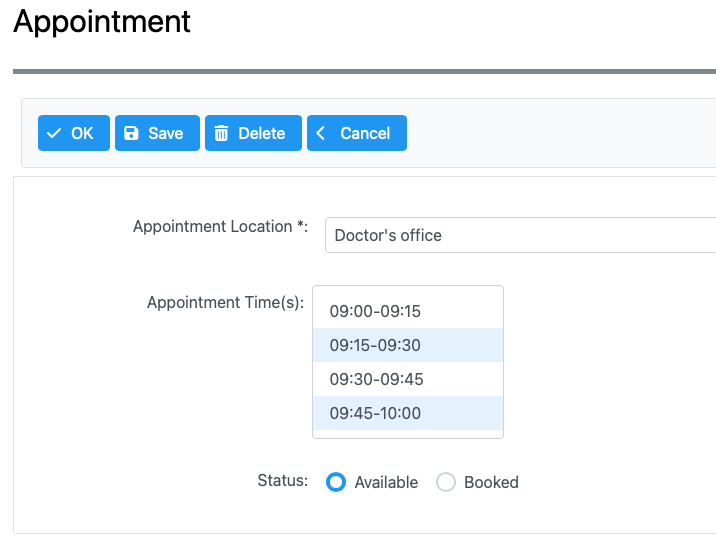
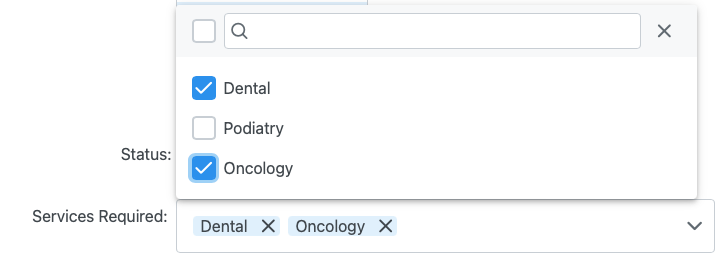
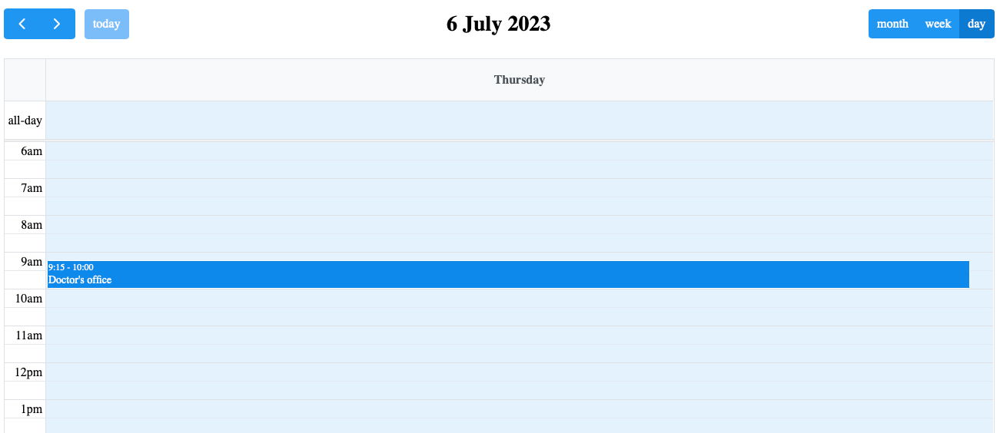

# Select Many and Schedule Widgets Skyve Example

## Select Many Menu

This is an example Skyve project which contains a single non-admin module view, Appointment, to demonstrate the ability to include a custom PrimeFaces component in a Skyve application using the responsive renderer.

The Appointment view demonstrates the use of the [PrimeFaces select many menu](https://www.primefaces.org/showcase/ui/input/manyMenu.xhtml?jfwid=83789) component to allow multiple appointment times to be selected from the list of available times.

### Steps Required

The customisations to this project required to make this work:

1. The Appointment [edit.xml](src/main/java/modules/selectMany/Appointment/views/edit.xml) uses the `widgetId` attribute to define which pieces of the Skyve edit view can be inserted.
1. A custom xhtml page, [selectMany.xhtml](src/main/webapp/test/selectMany.xhtml) is added inside the `webapp` folder.
1. The `selectMany.xhtml` page uses the `s:view` element to insert parts of the Skyve edit view into the page, specifying the `widgetId` attribute to identify the part of the view to be inserted. This allows the page to be constructed and include the custom PrimeFaces component in the correct location.
1. The selectMany module `router.xml` defines a route to the custom xhtml page when the Appointment document is being requested. This is what makes Skyve load the custom xhtml page instead of the standard edit page.
1. A backing bean, [SelectManyView.java](src/main/java/au/com/bizhub/faces/SelectManyView.java) is used by the `selectMany.xhtml` page by specifying the managed bean name in the `s:view` element. This backing bean is responsible for providing data for the selected Appointment document to the custom PrimeFaces component.

## Select Many Checkbox Component

An example implementation of the [PrimeFaces select many checkbox widget](https://www.primefaces.org/showcase/ui/input/manyCheckbox.xhtml?jfwid=83789) is also included on the Appointment page in this application. Including this in your project is the same as following the [steps required](#steps-required) as per the Select Many Menu component above.

## Schedule Component

This application also contains an example of displaying appointments using the [PrimeFaces schedule widget](https://www.primefaces.org/showcase/ui/data/schedule/basic.xhtml?jfwid=20c65). This is implemented in the [schedule.xhtml](src/main/webapp/test/schedule.xhtml) page.

The schedule displays appoinments saved in the database. The schedule component can be configured to allow drag and drop and allow events to be created from the schedule.

A backing bean, [ScheduleView.java](src/main/java/au/com/bizhub/faces/ScheduleView.java) is used by the `schedule.xhtml` page by specifying the managed bean name in the `s:view` element. This backing bean is responsible for providing data for the schedule component.